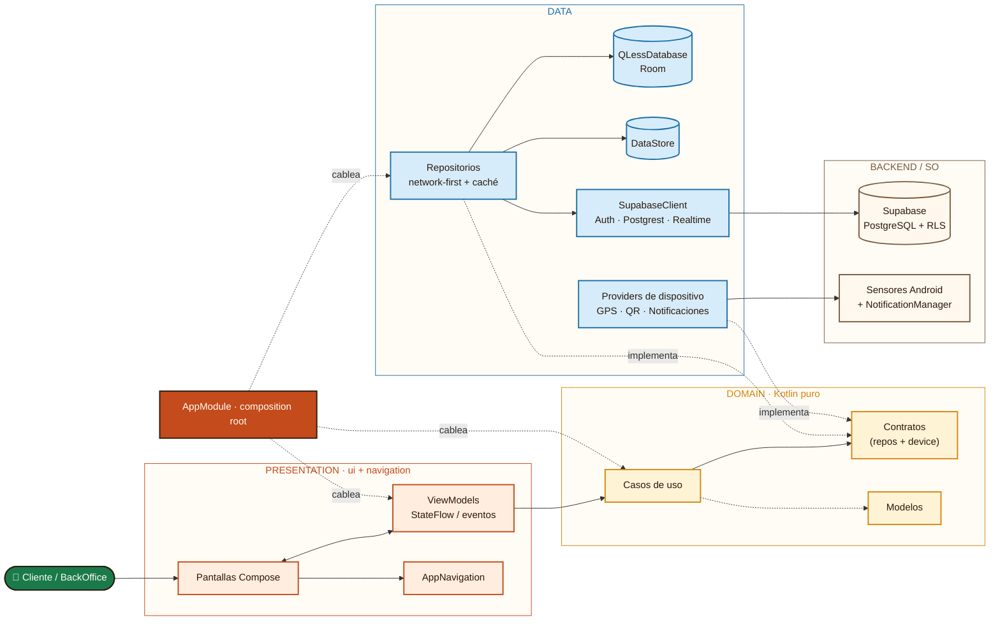
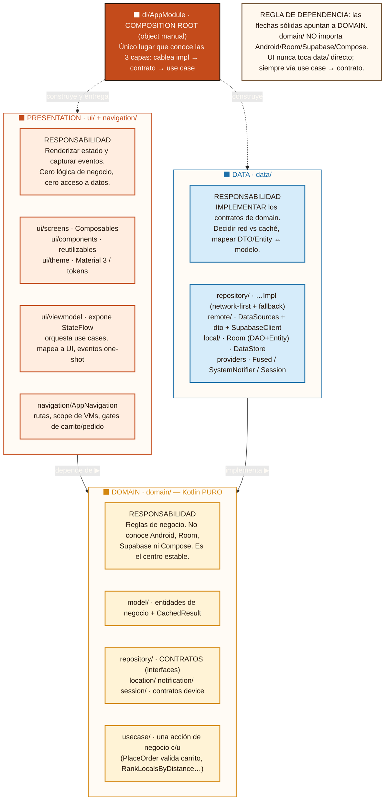
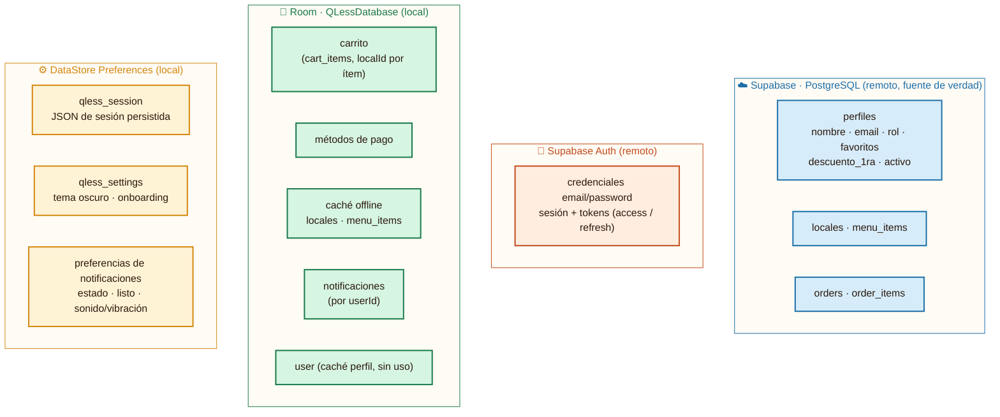

# QLess - Arquitectura de alto nivel

## Actores y Componentes Principales

* **Usuario (Cliente / Local):** Interactúa con la aplicación móvil.
* **Dispositivo Android:** Contenedor principal del sistema cliente.
    * **QLess Mobile App (Kotlin + Jetpack Compose):** La aplicación en sí, dividida en capas.
    * **Room Database:** Base de datos para persistencia local.
* **Backend:** Servidor remoto.
    * **API REST:** Interfaz de comunicación.
    * **PostgreSQL (Supabase):** Base de datos principal.

---

## Capas de la Aplicación (QLess Mobile App)

### 1. Presentation Layer (Capa de Presentación)
Gestiona la interfaz de usuario y la interacción directa con el usuario.
* **Pantallas Compose:** Recibe la interacción del usuario. 
    * Delega eventos de UI a los *ViewModels*.
    * Gestiona la navegación a través de *Navigation Compose*.
    * Inicia sesión comunicándose con *Google SSO* (Data Layer).
* **ViewModels:** Ejecutan acciones llamando a los *Casos de uso* (Domain Layer).
* **Navigation Compose:** Encargado de enrutar las vistas.

### 2. Domain Layer (Capa de Dominio)
Contiene la lógica de negocio principal.
* **Casos de Uso:** Orquestan la lógica.
    * Solicitan datos a los *Contratos de repositorio*.
    * Aplican reglas de negocio utilizando los *Modelos de dominio*.
    * Interactúan con los *Servicios del dispositivo* (GPS, Cámara, Sonido, Vibración).
* **Contratos de repositorio:** Interfaces que definen cómo se obtienen los datos (implementadas por la Data Layer).
* **Modelos de dominio:** Entidades puras de negocio.

### 3. Data Layer (Capa de Datos)
Gestiona el origen de los datos (local o remoto) y la autenticación.
* **Repositorios:** Implementan los contratos de la capa de dominio. Deciden si buscar datos locales o remotos.
    * Piden datos locales al *Local Data Source*.
    * Piden datos remotos al *Remote Data Source*.
* **Local Data Source:** Realiza lectura y escritura en la *Room Database* (incluye el
  centro de notificaciones, tabla `notifications`).
* **Remote Data Source:** Se comunica vía HTTP / JSON con la *API REST* del backend y,
  para el estado de pedidos en vivo, por **Supabase Realtime** (Postgres Changes) sobre
  un WebSocket.
* **Google SSO:** Gestiona la autenticación delegada comunicándose con la *API REST*.

### 4. Servicios del dispositivo
Hardware y funciones nativas accedidas por los casos de uso:
* **GPS Ubicación:** Para detectar local cercano.
* **Cámara Escaneo QR:** Para escanear códigos QR.
* **Sonido Avisos:** Para avisar cuando un pedido está listo.
* **Vibración Alertas:** Para alertar sobre cambios de estado.
* **Notificaciones (`SystemNotifier`):** Bandeja del sistema (`NotificationManager`) ante
  cambios de estado del pedido detectados por Realtime. Abstracción en `domain/`, impl en
  `data/`, inyectada por `AppModule`.

---

## Diagrama (Mermaid)

> Vista de alto nivel (slide). El flujo principal es horizontal: la UI invoca
> casos de uso de dominio, que se resuelven en datos locales/remotos. `AppModule`
> cablea todo (composition root manual).

---

## Estructura y responsabilidad de capas

Este diagrama no muestra el flujo de datos sino **qué carpeta hace qué, de qué
depende y de qué tiene prohibido depender**. La regla de oro es la flecha de
dependencia: siempre apunta hacia `domain/`, que no depende de nadie.

**Una frase por capa:**

- **`presentation`** depende de `domain` y de nada más hacia abajo; el ViewModel
  es el único que orquesta use cases y traduce a `UiState`. Que la UI no importe
  `data/` es lo que mantiene la regla.
- **`domain`** es el núcleo puro: define *qué* se hace (use cases) y *qué
  contrato* necesita (interfaces de repo/device), sin saber *cómo*.
- **`data`** es la única que sabe *cómo* (Supabase, Room, DataStore, Play
  Services) e **implementa** los contratos; la flecha invertida (data→domain) es
  la inversión de dependencias.
- **`di/AppModule`** es el único punto que ve las tres capas y las cose; por eso
  vive aparte y no "pertenece" a ninguna.

> Desviación honesta: hoy la flecha `AppModule → presentation` es *pull* (los VMs
> piden a `AppModule`), no *push* por constructor. Es el punto service-locator
> pendiente de migrar a Hilt (ver `.claude/pendientes.md` C3).

---

## Mapa de persistencia

Qué dato vive en cada mecanismo de almacenamiento.

> Room cachea `locales`/`menu_items` para el modo offline (RF4); Supabase sigue
> siendo la fuente de verdad. Los pedidos **no** se cachean en Room: se leen en
> vivo por Realtime y solo viven en Supabase.
